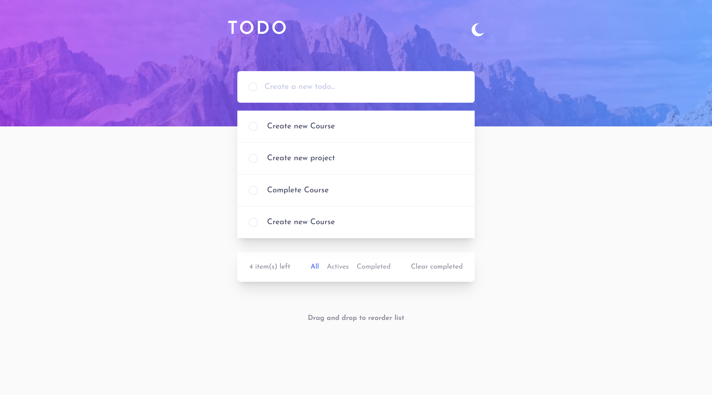

# Frontend Mentor - Todo app solution

This is a solution to the [Todo app challenge on Frontend Mentor](https://www.frontendmentor.io/challenges/todo-app-Su1_KokOW). Frontend Mentor challenges help you improve your coding skills by building realistic projects.

## Table of contents

- [Overview](#overview)
  - [The challenge](#the-challenge)
  - [Screenshot](#screenshot)
  - [Links](#links)
- [My process](#my-process)

  - [Built with](#built-with)
  - [What I learned](#what-i-learned)

  - [Useful resources](#useful-resources)

- [Author](#author)

## Overview

### The challenge

Users should be able to:

- View the optimal layout for the app depending on their device's screen size
- See hover states for all interactive elements on the page
- Add new todos to the list
- Mark todos as complete
- Delete todos from the list
- Filter by all/active/complete todos
- Clear all completed todos
- Toggle light and dark mode
- **Bonus**: Drag and drop to reorder items on the list

### Screenshot

### Links

- Solution URL: [Frontend Mentor Solution](https://www.frontendmentor.io/solutions/todo-list-app-created-with-tailwind-css-javascript-oop-vNMOFKdh9X)
- Live Site URL: [Live Project](https://smartlify-todo-list-app.netlify.app/)

## My process

### Built with

- Semantic HTML5 markup
- Flexbox
- CSS Grid
- Mobile-first workflow
- Tailwind CSS

### What I learned

I learned how to use OOP, creating classes and class methods, to keep my code maintainable.

### Useful resources

- [Tailwind docs](https://tailwindcss.com/) - This is the tailwind documentation which helped me with the use of light and dark mode

## Author

- Website - [Obinna Anosike Smart](https://portfolio-web-smartlify.netlify.app/)
- Frontend Mentor - [@smartlify08](https://www.frontendmentor.io/profile/smartlify08)
- Twitter - [@smartlify01](https://www.twitter.com/smartlify01)
